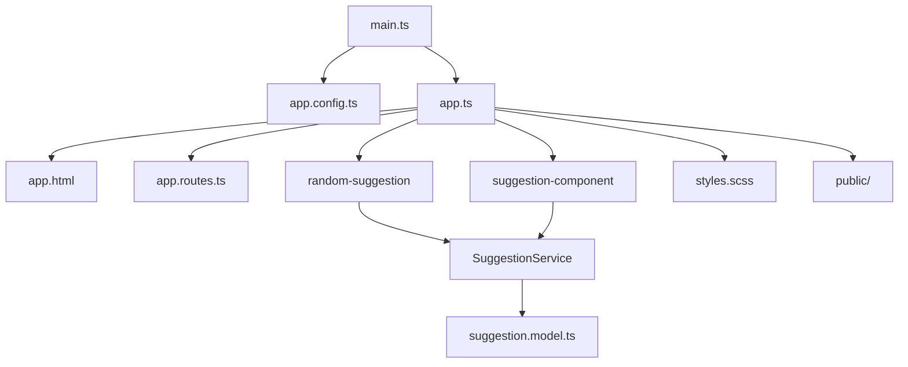

# Suggestions App: Architecture Overview

This document describes the main parts of the Suggestions Angular application and visualizes their connections using a Mermaid diagram.

## Application Structure

### 1. Entry Point & Shell
- **`src/main.ts`**: Bootstraps the application.
- **`src/app/`**: Contains the root app component (`app.ts`), template (`app.html`), configuration (`app.config.ts`), and routing (`app.routes.ts`).

### 2. Components
- **`src/components/`**: Contains feature components, each in its own folder:
  - `random-suggestion/`: Displays a random suggestion.
  - `suggestion-component/`: Handles individual suggestion display and logic.

### 3. Services
- **`src/services/suggestion.service.ts`**: Centralized business logic and API communication for suggestions.

### 4. Models
- **`src/models/suggestion.model.ts`**: Defines the data structure for suggestions.

### 5. Assets & Styles
- **`public/`**: Static assets used by the application.
- **`src/styles.scss`**: Global styles.

## Data Flow & Connections
- The app component initializes the application and sets up routing.
- Feature components interact with the service to fetch, display, and manage suggestions.
- The service communicates with the backend API and uses models for type safety.
- Global styles and assets are loaded for consistent UI.

## Mermaid Diagram

---

This diagram shows how the entry point, configuration, components, service, model, styles, and assets are connected in the Suggestions app.
